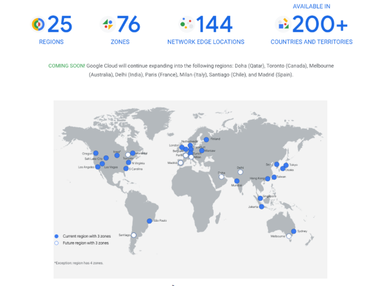
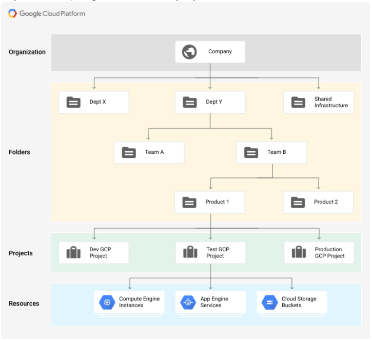

# Tổng quan về google cloud platform
- Google Cloud Platform viết tắt là (GCP) là nền tảng điện toán đám mây của Google cho phép doanh nghiệp xây dựng phát triển các ứng dụng trên chính hệ thống mà Google đang sử dụng cho sản phẩm của họ như Google Search, G Suite, YouTube, Google Maps
- Hệ thống của Google Cloud bao gồm rất nhiều Data Center trải rộng trên toàn thế giới. Bên trong mỗi Data Center đó là 1 hệ thống những thiết bị mạng, tủ rack, máy tính và những ổ đĩa, cũng như bao Data Center khác trên thế giới. Mỗi Data Center đó nằm trong 1 khu khu vực được gọi là Region (trải đều trên khắp các Châu lục (hiện tại chỉ trừ châu Phi). Mỗi region sẽ bao gồm các zone, được tách biệt về mặt địa lý, mỗi Region sẽ có tối thiểu 3 Zone  để bảo tính sẵn sàng và dự phòng cao.



- Dưới đây là bản đồ các Region GCP và những service hiện đang sẵn sàng trên các Region đó
https://cloud.google.com/about/locations

## Các nhóm services của GCP
- Google cung cấp cho khánh hàng sử dụng tài nguyên của họ thông qua hệ thống các Service của Google Cloud, được chia thành 14 chủng loại chuyên biệt với hơn 80 Services ở thời điểm hiện tại.

**Compute**
- ``Compute Engine (GCE)``: Đây là dịch vụ Iaas cung cấp những máy chủ ảo (VMs) hiệu suất cao được đặt trên nền tảng hạ tầng Google. Compute Engine còn tích hợp với những dịch vụ tính toán khác của Google Cloud như Trí tuệ nhân tạo và phân tích dữ liệu.
- ``App Engine (GAE)``: Cung câp cho việc xây dựng các ứng dụng web có nhu cầu mở rộng cao (highly scalable). Hỗ trợ nhiều ngôn ngữ lập trình và hỗ trợ container với option Flexible.
- ``Kubernetes Engine (GKE)``: Nền tảng Kubernetes của google, giúp tạo và quản lý K8s cluster.
- ``Cloud Functions``: [Tham khảo thêm](https://topdev.vn/blog/ginco-da-su-dung-va-toi-uu-cloud-functions-nhu-the-nao/)   

**Storage and Database**
- ```Cloud Storage```: Dịch vụ Object storage, lưu trữ các loại dữ liệu với dung lượng không giới hạn và khả năng truy xuất liên tục và thường xuyên. Cung cấp một loạt các tùy chọn lưu trữ bao gồm geo-reduntdant (độ trễ thấp, nội dung QPS cao phục vụ cho người dùng được phân phối trên các vùng địa lý), regional (cho khối lượng công việc trong một khu vực cụ thể), nearline (đối với dữ liệu được truy cập ít hơn mỗi tháng một lần), và coldline (đối với dữ liệu được truy cập ít hơn một lần một năm.)…
- ```Filestore```: dịch vụ NAS storage cho GCE và GKE, được quản lý hoàn bởi GCP
- ```Persistent Disk```: Block storage, được tích hợp vào các dịch vụ như GKE và GCE dưới dạng ổ đĩa để chạy filesystem hay các ứng dụng, hoặc làm lưu trữ cho database
- ```Local SSD```: Ổ đĩa tạm được gắn vào VM hoặc Container. Dữ liệu trong ổ đĩa này sẽ bị reset khi VM hoặc Container khởi động lại hoặc stop. Là loại ổ đĩa có tốc độ  (IOPS) cao nhất trong số các option của GCP.
- ```Cloud SQL```: Dịch vụ cơ sở dữ liệu MySQL được quản lý hoàn toàn để lưu trữ cơ sở dữ liệu quan hệ MySQL trên cơ sở hạ tầng của Google.
- ```Cloud Spanner```:  cũng là dịch vụ Relational Database những xịn hơn, với khả năng scaling ở level Global, đảm bảo tính toàn vẹn của các transaction, các query hay các bảng, với khả năng tự động hóa hoàn toàn về replicate và HA. Và...tất nhiên là giá chát hơn nhiều
- ```Cloud Bigtable```: Dịch vụ cơ sở dữ liệu NoSQL Big Data hiệu suất cao, được thiết kế để hỗ trợ khối lượng công việc rất lớn với độ trễ chắc chắn thấp và tốc độ băng thông cao. Google sử dụng Bigtable nội bộ để cung cấp các dịch vụ bao gồm Tìm kiếm và Gmail.

**Network Services:**
- ```VPC```: tạo và cấu hình các vùng mạng, các subnetwork, cấu hình network policy, firewall rules
- ```Load Balancing```: Cung cấp tính năng cân bằng tải ở 2 dạng Network và HTTP(S), hỗ trợ off-load SSL
- ```Cloud DNS```: Dịch vụ DNS của GCP
- ```Cloud NAT```: Cung cấp Internet Access cho các các resource thuộc các subnetwork private
- ```Cloud VPN```: Cung cấp Kết nối đến các môi trường On Premise hoặc các public cloud khác như AWS hay Azure

**Big Data**
- ```BigQuery```:  Nền tảng dịch vụ lưu trữ dữ liệu lớn với khả năng phân tích và truy xuất dữ liệu với tốc độ cực nhanh. BigQuery giải quyết các yêu cầu của doanh nghiệp bằng cách xử lý các truy vấn SQL siêu nhanh, qua đó hỗ trợ doanh nghiệp trong việc ra quyết định cực nhanh. 
- ```Cloud Dataflow```: Dịch vụ xử lý dữ liệu thời gian thực được quản lý hoàn toàn để xử lý dữ liệu lớn hàng loạt và trực tuyến, hỗ trợ ETL, tính toán hàng loạt và tính toán liên tục.
- ```Dataproc```: Dịch vụ Apache Hadoop, Apache Spark, Apache Pig và Apache Hive được sử dụng để xử lý các tập dữ liệu lớn.
Cloud Datalab:Một công cụ tương tác để thăm dò, phân tích và trực quan hóa dữ liệu quy mô lớn được xây dựng trên Jupyter (trước đây là IPython). Nó hỗ trợ phân tích dữ liệu bằng BigQuery, Compute Engine và Cloud Storage bằng Python, SQL và JavaScript.

**Mô hình phân tầng quản lý GCP**




Thành phần cơ bản nhất trong sơ đồ tổ chức của GCP là **Resource**, nó có thể là GCE VM Instance, GCS Bucket hay VPC Network.
Những **Resource** này được quản lý trong một **Project**, đây là cấp tổ chức đầu tiên trong sơ đồ của GCP. Tất cả các **Resource** trong 1 **Project**  đều được tách biệt hoàn toàn với các **Project** khác.
Các **Project** có thể nằm bên trong 1 **Folder** hoặc không. **Folder** là một cơ chế tùy chọn của GCP, giúp tăng khả năng quản lý **Project** và **Resource** có cùng chức năng, cùng phòng ban, hoặc có những chính sách chung cần áp dụng.
Level quản lý cao nhất là **Organization**, đại diện cho tổ chức, doanh nghiệp sử dụng GCP, là node gốc của Cây Resource. Những chính sách IAM được áp dụng trên Organization sẽ được áp dụng kế thừa lên toàn bộ các **Project** và **Folder** thành viên.
Mặc định người dùng GCP ở dạng cá nhân sẽ không cần phải khởi tạo **Organization**, nhưng có một số tính năng của Resource Manager sẽ không thể sử dụng được nếu không có **Organization**. **Organization** sẽ được gắn với tài khoảng Google Workspace hoặc Cloud Identity.

# Giới thiệu và làm quen với môi trường làm việc với GCP
- Để tương tác và làm việc với GCP, chúng ta có thể dụng GCP Console, Cloud Shell, Cloud SDK hoặc các Client Library. Đối với anh em Cloud Engineer và DevOps thì chúng ta sẽ sử dụng nhiều nhất là Console, Cloud SDK và Cloud Shell, nên buổi hôm nay tôi sẽ tập trung giới thiệu và hướng dẫn mọi người làm quen với 3 tool này.

- **GCP Console**
  - Là giao diện graphical của GCP, giúp tạo và quản lý tất cả các Resource trên GCP.
  - Các tính năng chính trên GCP mà chúng sẽ thường xuyên sử dụng:
    - ```Resource Management```: Công cụ tìm kiếm resource nhanh chóng, dashboard tổng giúp theo dõi và giám sát tập trung các Resource
    - ```Billing```: Tạo và quản lý Billing Account, theo dõi và thống kê chi tiết chi phí sử dụng, thiết lập các giới hạn Budget
    - ```SSH in Browser```: Tool SSH built-in giúp anh em SSH trực tiếp vào GCE VM Instance mà không cần cài đặt thêm tool gì trên máy cá nhân, rất hữu ích trong trường hợp cần debug từ xa mà không thể sử dụng máy tính của mình
    - ```Activity Stream```: Nhật ký toàn bộ những hành động, những thao tác trên Cloud của tất cả các user, rất hữu ích cho việc truy vết sự cố và audit hệ thống
    - ```Mobile apps```: Console cũng hỗ trợ luôn Mobile app xịn xò cho cả iOS và Android luôn dành cho những anh em bận rộn, phải di chuyển liên tục
    - ```Cloud Shell```: cái này lát nữa sẽ nói chi tiết hơn 
    - ```Dianogstics```: Công cụ giúp truy vết sự cố trên Production nhanh chóng. Công vụ xem Logs hỗ trợ tìm kiếm và bộ lọc
    - ```Admin```: quản lý và audit truy cập của người dùng vào các Resource trên Cloud
    - ```Marketplace```: Launch nhanh chóng các ứng dụng đã được đóng gói sẵn như các loại Database, blog, CMS, CRM...lên GCP

- **Cloud Shell**
  - Vẫn là GCP Console thôi, nhưng là phiên bản CLI, và được tích hợp luôn lên trên GCP Console cho anh em sử dụng
  - Vậy Cloud Shell cho anh em những gì:

    - Về cơ bản thì Cloud Shell là 1 cái VM tạm thời, và chúng ta được truy cập vào VM đó thông cái gọi là Cloud Shell trên console
    - Cloud Shell cho mỗi người dùng 5GB lưu trữ Persistent Disk trong thư mục $HOME
    - Cloud SDK và các công cụ cần thiết khác đều được cài đặt sẵn
    - Tính năng Web View
    - Cloud Shell Editor: Công cụ cho anh em code ngay và luôn trên Browser, hỗ trợ Java, Go, Python, Nodejs, PHP và Ruby

  - Cần lưu ý gì khi sử dụng Cloud Shell:
    - Nếu anh em đóng cửa sổ Cloud Shell, hoặc sau 1 tiếng k có hoạt động, Cloud Shell sẽ bị Reset, tưc là toàn bộ những gì nằm ngoài thư mục $HOME Cloud Shell của anh em sẽ bị xóa, đi cùng với nó là mọi cấu hình hay biến môi trường mà anh em đã thiết lập trong phiên làm việc
    - Để giữ lại những cấu hình và biến môi trường cần thiết, anh em cần lưu chúng vào 1 file trong thư mục $HOME, và gọi nó lên mỗi lần start Cloud Shell bằng lệnh source
- **Cloud SDK**
  - Bộ công cụ và thư viện để tương tác với GCP bằng CLI
    - Bao gồm các công cụ:
    - gcloud: tương tác với Compute Engine và nhiều service khác
    - gsutil: tương tác với Cloud Storage
    - bq: tương tác với BigQuery

# Tham Khảo
- https://gcloudvn.com/kienthuc/google-cloud-platform-la-gi/