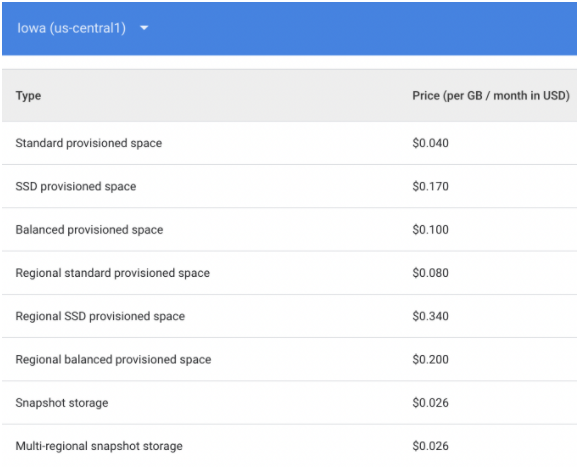

# Chi phí dịch vụ GCE
- Chi phí sử dụng Google Compute Engine được gửi vào cuối mỗi chu kì thanh toán (đơn vị thanh toán: $ - Đô la Mỹ)
- Đối với Google Compute Engine: kích thước ổ đĩa (disk size), bộ nhớ (memory) và mức sử dụng mạng (network usage) được sử dụng đơn vị gigabyte (GB).
  - Note:  1 GB thường được định nghĩa là 1.000.000.000 byte.  GiB (Gibibytes) là một đơn vị tiêu chuẩn được sử dụng trong lĩnh vực xử lý và truyền dữ liệu và được định nghĩa là cơ sở 1024 chứ không phải cơ sở 1000. Ví dụ: 1 GB được định nghĩa là 1000^3 byte, trong khi 1 GiB được định nghĩa là 1024^3 byte.

Chi phí dịch vụ sẽ bao gồm các chi phí dành cho

  - Chi phí Instance
  - Chi phí Disk và Image
  - Chi phí Network
  - Chi phí GPU

## Các cách tra cứu thông tin chi phí giá dịch vụ GCE

1. Xem chi phí ước tính cho các phiên bản và tài nguyên Compute Engine trực tiếp trong khi tạo Instance trong Google Cloud Console.
2. Ước tính tổng chi phí dự án dựa trên các phiên bản và tài nguyên cần thiết thông qua công cụ tính toán của Google.
Ngoài 2 cách phổ biến trên thì còn có thể xem và tải xuống từ Bảng giá trong Google Cloud Console hoặc nhận thông tin về giá thông qua API.
Sử dụng các công cụ tuỳ theo nhu cầu của người dùng:

  - Sử dụng xem chi phí trong Google Cloud Console để nắm được chi phí của hệ thống đang xây dựng kèm theo các chính sách giảm giá cho từng instance.
  - Sử dụng Công cụ tính toán của google và bảng giá để có thể tính toán chi phí trước khi xây dựng hệ thống theo kiến trúc, cấu hình định trước.
  - Sử dụng bảng giá thông qua API phục vụ cho các bài toán xây dựng hệ thống billing, tích hợp với các ứng dụng khác theo nhu cầu.
- Google luôn có chính sách giảm giá cho người dùng sử dụng liên tục (càng sử dụng nhiều trong 1 tháng thì càng được chiết khẩu nhiều hơn) hoặc cam kết sử dụng 1 năm, 3 năm. Chi phí sử dụng dịch vụ có thể giảm tới 57% (cam kết sử dụng 3 năm) so với sử dụng theo giờ (theo nhu cầu).

## II. Chi tiết cách tra cứu thông tin chi phí giá dịch vụ GCE.

- Chi phí ước tính cho các phiên bản và tài nguyên Compute Engine trực tiếp trong khi tạo instances trong Google Cloud Console.
    - B1. Truy cập [Google Cloud Console](https://console.cloud.google.com/home/dashboard?project=ultra-bearing-294314)
    - B2. Bên thanh **Navigation menu**, chọn **Billing**
    - B3. Chọn tiếp **Manager Billing Account** và chọn **Account Billing** tương ứng với Project cần xem.

- Ước tính tổng chi phí dự án dựa trên các phiên bản và tài nguyên cần thiết thông qua [công cụ tính toán của Google](https://cloud.google.com/products/calculator).
    - B1. Truy cập trang công cụ tính toán của Google.
    - B2. Điền các tham số của instances cần triển khai rồi chọn Estimate giá:

Trong đó:

- Number of instances: là số instances cần triển khai

- Operating system: là hệ điều hành của instances - Có một vài các OS cao cấp sẽ được tính chi phí.

- Machine Class: Hỗ trợ phiên bản instance thông thường (regular) và phiên bản instance ưu tiên (Preemptible) có chi phí thấp hơn nhiều (khoảng 80%) so với  phiên bản thông thường. (Phiên bản ưu tiên luôn bị dừng sau 24h)

- Machine Family: Các nhóm instances được phân loại theo mục đích sử dụng: nhóm thông thường và các nhóm tối ưu hoá.

- Series:  Nhóm instances tương ứng được lựa chọn

- Machine Type: Chi tiết thông số cấu hình của instance: số vCPU, Ram,...

- Datacenter Location: Vị trí đặt của máy chủ, instances (Region)

- Instance using epehemeral public IP/ static public IP:  Số máy ảo sử dụng IP động/ IP tĩnh

- Commit usage: Cam kết sử dụng: cam kết sử dụng 1 hoặc 3 năm sẽ được hưởng chiết khấu từ Google lên tới 57%

- Thời gian hoạt động trung bình của server trong ngày, tuần.

*Chi phí các loại máy E2 căn cứ theo vCPU và memory:*

*Tham khảo thêm về chi phí các loại VM theo resource(vCPU/mem/disk/...) và theo region tại [đây](https://cloud.google.com/compute/vm-instance-pricing)*

**Chi phí Disk và Image**
Disk:
Bao gồm: 

  - Persistent disk: Ổ lưu trữ cơ bản
  - SSD Disk: Ổ lưu trữ có tốc độ đọc/ghi cao
  - Snapshot disk:Ổ lưu trữ bản sao của máy ảo

 

- Image: Các image phổ biến được cung cấp miến phí bởi Google. Một vài image cao cấp được liệt kê và tính theo công thức:

    - Red Hat Enterprise Linux (RHEL and RHEL for SAP)
    - SUSE Linux Enterprise Server (SLES and SLES for SAP)
    - Windows Server
    - SQL Server
    - Ubuntu Pro

- Red Hat Enterprise Linux (RHEL) và RHEL cho SAP image
RHEL:

    - $ 0,06 USD / giờ cho các phiên bản có 4 vCPU trở xuống
    - $ 0,13 USD / giờ cho các phiên bản có hơn 4 vCPU
RHEL cho SAP với HA image và service update:

    - $ 0,10 USD / giờ cho các phiên bản có 4 vCPU trở xuống
    - $ 0,225 USD / giờ cho các phiên bản có hơn 4 vCPU
Tất cả RHEL và RHEL cho SAP image đều bị tính phí tối thiểu 1 phút . Sau 1 phút, RHEL image được tính theo từng ​​giây.

SLES và SLES cho SAP image

SLES image:

    - $ 0,02 USD / giờ cho f1-microvà g1-small
    - $ 0,11 USD / giờ cho tất cả các loại máy khác
SLES cho SAP image:

    - $ 0,17 USD / giờ cho các phiên bản có 1 - 2 vCPU
    - $ 0,34 USD / giờ cho các phiên bản có 3 - 4 vCPU
    - $ 0,41 USD / giờ cho các phiên bản có 5 vCPU trở lên
Tất cả SLES image đều bị tính phí tối thiểu 1 phút . Sau 1 phút, hình ảnh RHEL được tính theo từng ​​giây.

Window Server image

    - $ 0,023 USD / giờ cho f1-microvà g1-small
    - $ 0,046 USD/CPU/ giờ cho tất cả các loại máy khác
SQL Server image

    - $ 0,399 USD /CPU/ giờ cho SQL Server Enterprise
    - $ 0,1645 USD /CPU/ giờ cho SQL Server Standard
    - $ 0,011 USD /CPU/ giờ cho Web SQL Server
    - Không tính thêm phí cho SQL Server Express
Ubuntu Pro
Chi phí = (Dung lượng Ram x $ 0,000127 USD/GB/giờ) + ( Số vCPU x chi phí vCPU được tính theo bảng dưới)

# Tham khảo
- https://cloud.google.com/compute/vm-instance-pricing